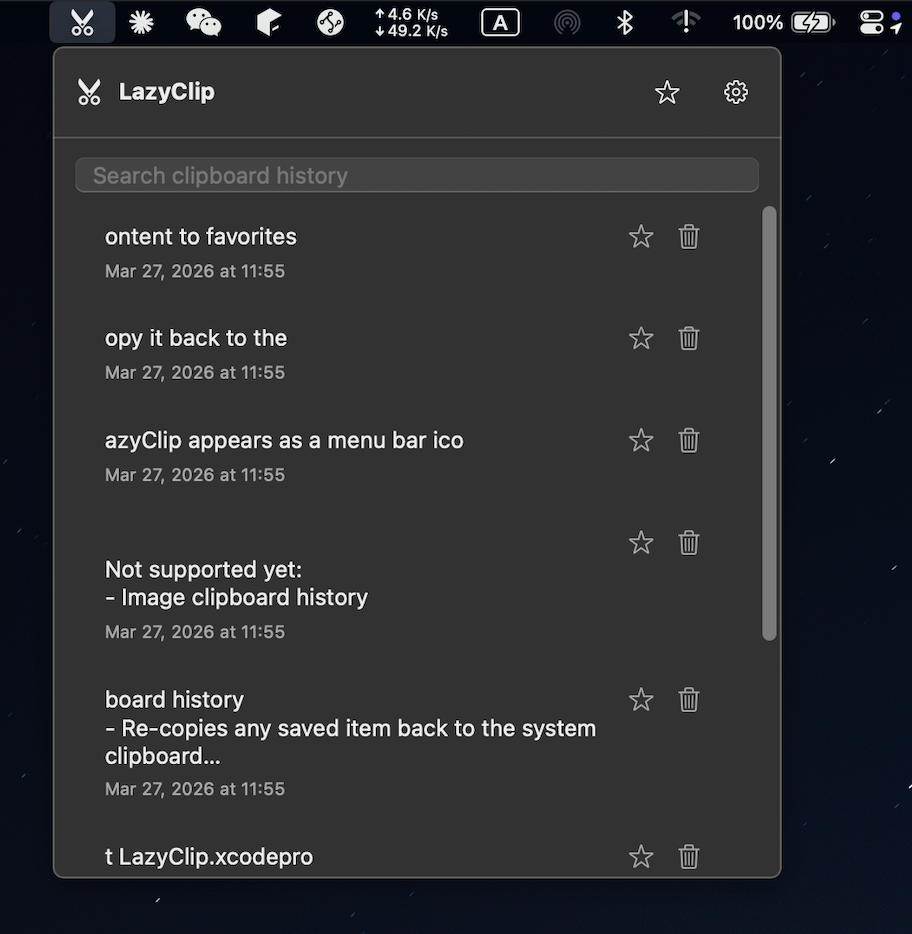
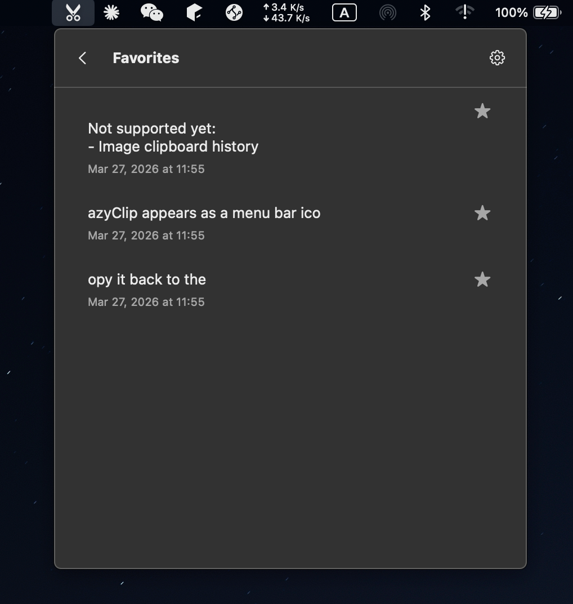

# LazyClip | [English](./README.en.md)

LazyClip 一个轻量、原生、仅本地存储的 macOS 菜单栏剪贴板历史工具

## 运行截图




## 功能

- 菜单栏常驻，随时打开历史面板
- 自动记录纯文本/图片剪贴板历史
- 本地 SQLite 持久化存储
- 搜索历史记录
- 点击条目重新复制到系统剪贴板
- 收藏 / 取消收藏常用内容
- 删除单条历史记录
- 暂停 / 恢复剪贴板记录
- 清空全部历史记录
- 设置历史记录保留上限

## 打包

```bash
./scripts/build-dmg.sh
```

该脚本会构建 Release 版本应用并生成：

- `build/DerivedData/Build/Products/Release/LazyClip.app`
- `build/LazyClip.dmg`

安装 *LazyClip.dmg* 运行